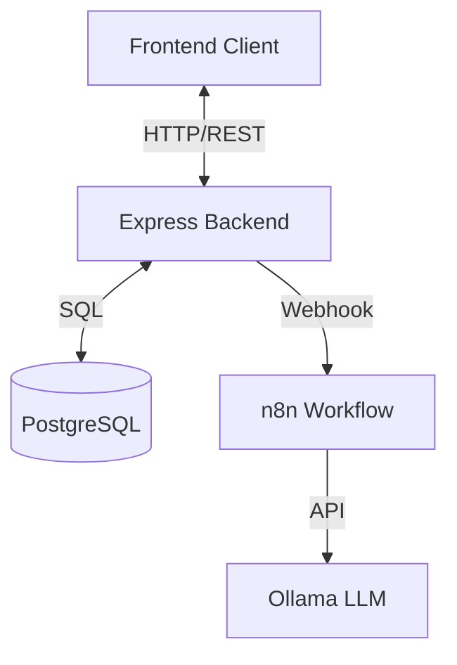

# Local Chat — Итоговая документация проекта

**Дата актуализации:** 10.01.2026

## 1. Обзор проекта

**Local Chat** — это одностраничное веб-приложение (SPA) для общения с локальной или удаленной LLM (через n8n webhook). Проект разработан как приватный аналог ChatGPT для личного использования или небольшой группы лиц.

### Ключевые возможности

- **Чат с ИИ**: Поддержка маркдауна, подсветка кода, история сообщений.
- **Очередь запросов**: Асинхронная обработка сообщений через внутреннюю очередь на бэкенде.
- **Умная отмена**: Возможность прервать генерацию ответа.
- **История**: Сохранение всех диалогов в базе данных PostgreSQL.
- **Профили**: Управление именем пользователя.
- **Безопасность**: JWT-сессии, защищенные маршруты.

---

## 2. Архитектура

Приложение построено на микросервисной архитектуре и упаковано в Docker контейнеры.



### Стек технологий

- **Frontend**: React (Vite), Tailwind CSS, Lucide Icons, Axios.
- **Backend**: Node.js, Express.js, `pg` (PostgreSQL client).
- **База данных**: PostgreSQL 16.
- **Инфраструктура**: Docker, Docker Compose.

---

## 3. База данных (PostgreSQL)

Схема базы данных спроектирована для надежного хранения пользователей, чатов и истории сообщений.

### Таблицы

#### `users` (Пользователи)

| Колонка         | Тип       | Описание            |
| --------------- | --------- | ------------------- |
| `id`            | UUID (PK) | Уникальный ID       |
| `username`      | VARCHAR   | Логин (уникальный)  |
| `password_hash` | VARCHAR   | Хэш пароля (bcrypt) |
| `date_created`  | TIMESTAMP | Дата регистрации    |

#### `profiles` (Профили)

| Колонка      | Тип       | Описание          |
| ------------ | --------- | ----------------- |
| `id`         | UUID (PK) | Уникальный ID     |
| `user_id`    | UUID (FK) | Ссылка на `users` |
| `first_name` | VARCHAR   | Имя               |
| `last_name`  | VARCHAR   | Фамилия           |

#### `sessions` (Сессии)

| Колонка        | Тип       | Описание          |
| -------------- | --------- | ----------------- |
| `id`           | UUID (PK) | Уникальный ID     |
| `user_id`      | UUID (FK) | Ссылка на `users` |
| `token`        | VARCHAR   | Токен сессии      |
| `date_expires` | TIMESTAMP | Время истечения   |

#### `chats` (Чаты)

| Колонка        | Тип       | Описание                                     |
| -------------- | --------- | -------------------------------------------- |
| `id`           | UUID (PK) | Уникальный ID                                |
| `user_id`      | UUID (FK) | Владелец чата                                |
| `chat_number`  | INT       | Порядковый номер (1, 2, 3...)                |
| `title`        | VARCHAR   | Название ("Чат №1")                          |
| `status`       | ENUM      | `idle` (готов) или `generating` (в процессе) |
| `has_unread`   | BOOLEAN   | Флаг непрочитанного                          |
| `date_updated` | TIMESTAMP | Время последнего сообщения                   |

#### `messages` (Сообщения)

| Колонка        | Тип       | Описание               |
| -------------- | --------- | ---------------------- |
| `id`           | UUID (PK) | Уникальный ID          |
| `chat_id`      | UUID (FK) | Ссылка на `chats`      |
| `role`         | ENUM      | `user` или `assistant` |
| `content`      | TEXT      | Текст сообщения        |
| `date_created` | TIMESTAMP | Время отправки         |

---

## 4. API Reference

Все запросы к API (кроме `/auth/login`) требуют заголовка `Authorization: Bearer <token>`.

### Аутентификация

- `POST /api/auth/login` — Вход. Тело: `{ username, password }`.
- `POST /api/auth/logout` — Выход.
- `GET /api/auth/me` — Получение данных текущего пользователя.

### Профиль

- `GET /api/profile` — Получить профиль.
- `PUT /api/profile` — Обновить профиль. Тело: `{ first_name, last_name }`.

### Чаты

- `GET /api/chats` — Список чатов (новые сверху).
- `POST /api/chats` — Создать новый чат.
- `GET /api/chats/:id` — Получить историю чата.
- `DELETE /api/chats/:id` — Удалить чат.
- `POST /api/chats/:id/messages` — Отправить сообщение. Возвращает `202 Accepted`, если поставлено в очередь.
- `POST /api/chats/:id/cancel` — Отменить генерацию.
- `POST /api/chats/:id/messages/regenerate` — Регенерировать последний ответ бота.

---

## 5. Инструкция по запуску

Для запуска вам потребуются **Docker** и **Docker Compose**.

### Быстрый старт

1.  **Клонируйте репозиторий:**

    ```bash
    git clone <repo_url>
    cd local-chat
    ```

2.  **Запустите проект:**

    ```bash
    docker-compose up -d --build
    ```

3.  **Доступ:**

    - **Frontend**: [http://localhost:5173](http://localhost:5173)
    - **Backend**: [http://localhost:3000](http://localhost:3000)

4.  **Данные для входа:**
    - **Логин**: `admin`
    - **Пароль**: `admin123`

### Разработка

Если вы вносите изменения в код, пересоберите контейнеры:

```bash
docker-compose up -d --build
```

Для просмотра логов:

```bash
docker-compose logs -f
```
